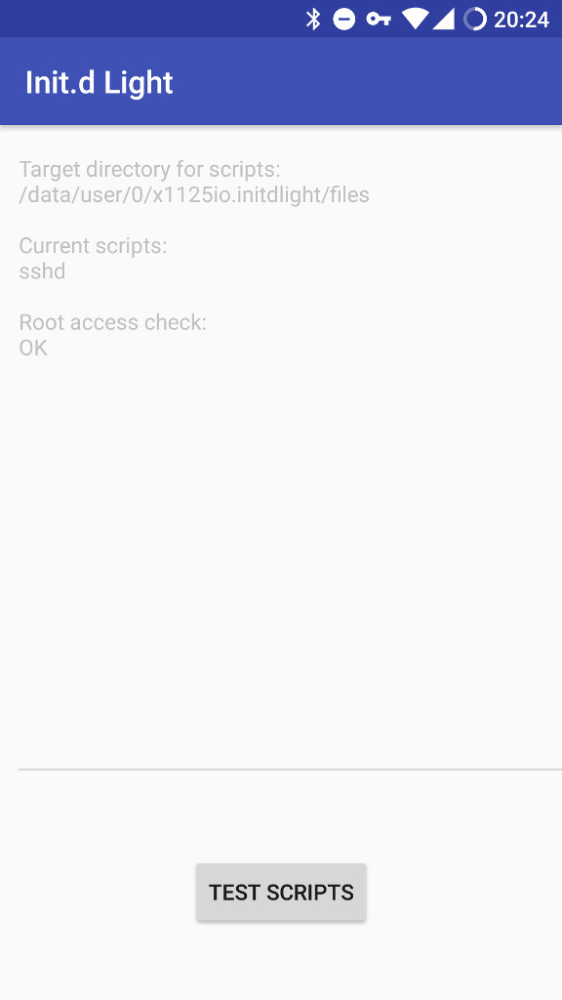

# init.d light

This app provides simplest functionality for starting scripts on Android startup.
Since the init.d support was [dropped](https://www.reddit.com/r/cyanogenmod/comments/41nlbi/how_do_we_get_initd_working_in_cm/) in CM 12.1, there doesn't seem to be a straight-forward way of doing this nowadays.

There is similar software out there, but the source code was either pretty bad or it was closed-sourced at all (which is a no-go for me, especially when running Apps as root).

## How it works

After installing the App, you'll have to run it at least once for the BootReceiver to work and for the root access to be granted.

It will also show you where to place your scripts, which is usually `/data/user/0/x1125io.initdlight/files`.

Every script in there will be launched via `su -c sh [file]`.

## Debugging

You can use the "TEST SCRIPTS"-Button within the App to run all the scripts like on a startup.
The exit-codes, stdout and stderr will be printed.

You can also log the status of the processed scripts via the "initdlight" logtcat tag.
```
$ adb logcat -s initdlight
--------- beginning of system
--------- beginning of main

09-17 03:19:39.961  9161  9161 D initdlight: started sshd
```

It will also log exit-code, stdout and stderr when the exit-code is not 0.

## Screenshot



## About

Launcher icon powered by Nick Roach (https://www.elegantthemes.com/)